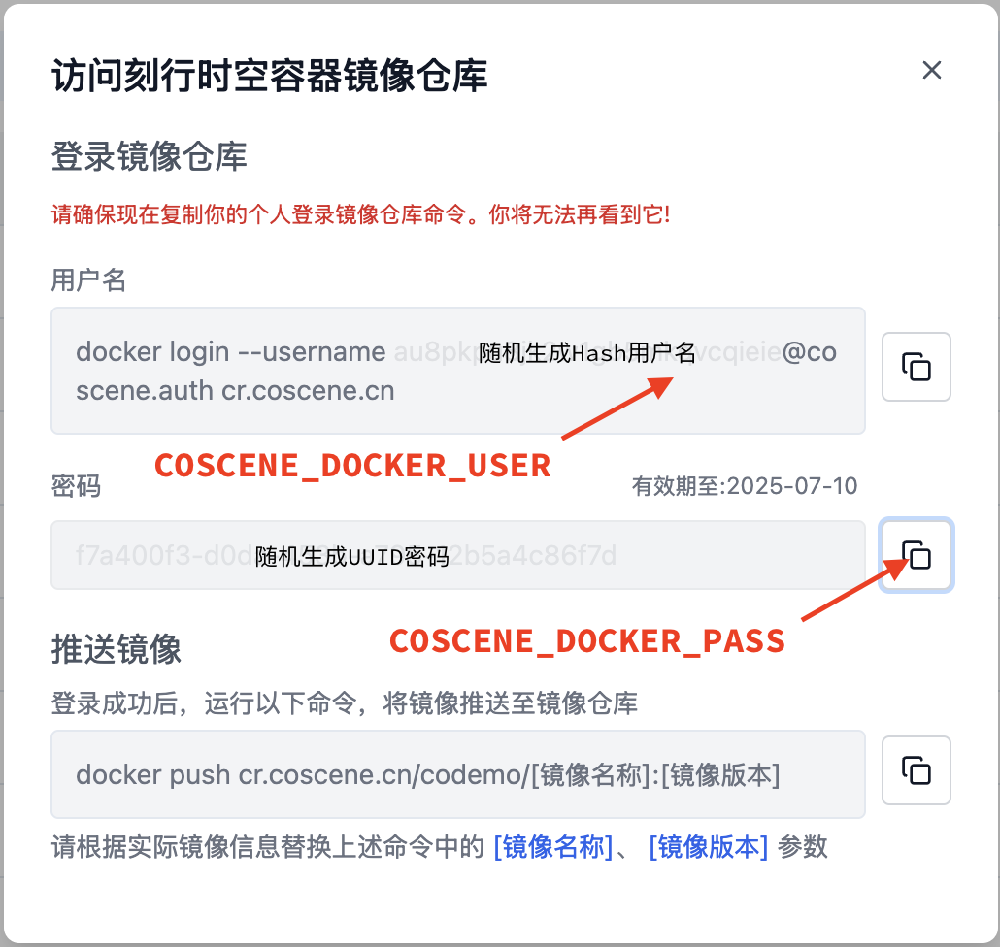

# MP4 to MCAP Converter

A tool to convert MP4 video files into MCAP format with H264 encoding. This tool is particularly useful for robotics applications that need to store video data in MCAP format.

## Project Structure

```
.
├── Dockerfile           # Container definition
├── docker-compose.yml  # Container orchestration
├── environment.yml     # Conda environment definition (optional)
├── requirements.txt    # Python dependencies
├── mp4_to_mcap.py     # Main conversion script
└── writers.py         # MCAP writer utilities
```

## Key Components

### mp4_to_mcap.py
The main script that handles MP4 to MCAP conversion. Key features:
- Supports batch processing of multiple MP4 files
- Progress bar showing conversion status
- Configurable topic names and timestamps
- Handles both file and directory inputs

### writers.py
Utility class for writing Protobuf messages to MCAP format:
- Handles schema registration
- Manages channel IDs
- Provides clean interface for message writing

### requirements.txt
Python dependencies:
```
av==12.3.0                        # For video processing
foxglove-schemas-protobuf==0.2.2  # Protobuf schemas
mcap==1.1.0                       # MCAP file format
mcap-protobuf-support==0.5.2      # Protobuf support for MCAP
numpy==1.24.4                     # Numerical operations
opencv-python==4.10.0.84          # Video processing
tqdm==4.67.1                      # Progress bars
```

## Setup Instructions

### Local Development

1. Install Python dependencies:
```bash
pip install -r requirements.txt
```

2. Run the converter:
```bash
python mp4_to_mcap.py --input-paths /path/to/videos --output-dir /path/to/output
```

### Docker Setup

1. Build the image:
```bash
docker compose build
```

2. Run the converter:
```bash
docker compose run converter
```

### Environment Variables

- `TOPIC`: Topic name for the video stream (default: "/video/h264")
- `INPUT_PATHS`: Input directory or file paths (default: "/cos/files")
- `OUTPUT_DIR`: Output directory for MCAP files (default: "/cos/outputs")
- `START_TIME_NS`: Optional start time in nanoseconds for timestamp alignment

## Usage Examples

1. Convert a single file:
```bash
python mp4_to_mcap.py --input-paths video.mp4 --output-dir ./output
```

2. Convert all MP4s in a directory:
```bash
python mp4_to_mcap.py --input-paths ./videos --output-dir ./output
```

3. Using Docker with custom paths:
```bash
docker compose run -e INPUT_PATHS=/data/videos -e OUTPUT_DIR=/data/output converter
```

## Docker Configuration

### Dockerfile
- Based on ROS Noetic for compatibility
- Installs necessary system dependencies
- Sets up Python environment with required packages
- Configures working directory and volumes

### docker-compose.yml
- Builds and runs the converter service
- Mounts input and output volumes
- Configures environment variables
- Enables interactive mode for debugging

## CI/CD Pipeline

```shell

# Create a new secret
gh secret set COSCENE_DOCKER_USER --env coscene.cn:codemo --body "xxxxxxxxxxxxxxxxxxxxxxxxxx@coscene.auth"
gh secret set COSCENE_DOCKER_PASS --env coscene.cn:codemo --body "xxxxxxxx-xxxx-xxxx-xxxx-xxxxxxxx"
```


## Notes

- The converter maintains frame timing from the original MP4
- Progress bars show conversion status and estimated time
- Supports both file and directory inputs
- Creates one MCAP file per input MP4

## Error Handling

The script will fail with clear error messages if:
- Input paths are not specified
- Output directory is not specified
- No MP4 files are found in input paths
- Input files are not valid MP4s

## Contributing

Feel free to submit issues and pull requests for improvements.
